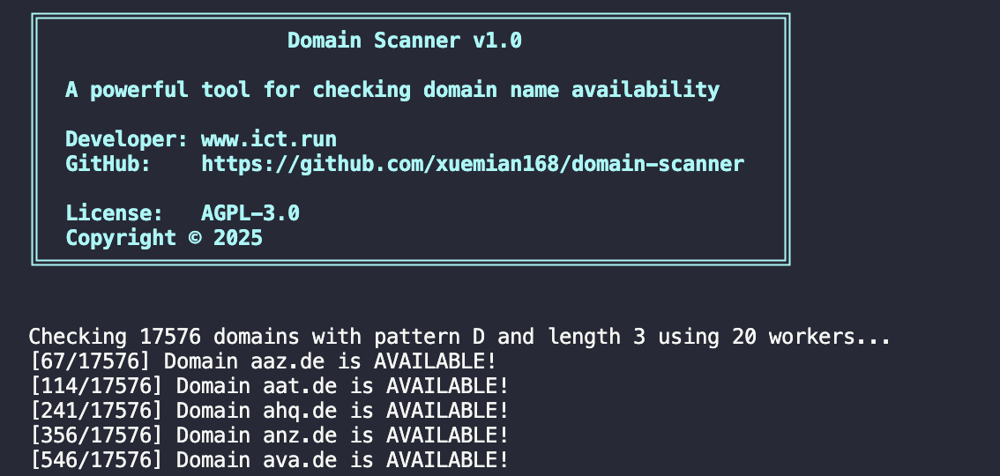

English | [中文](./README.zh.md)

[](https://golang.org)
[](LICENSE)
[](https://github.com/xuemian168/domain-scanner/stargazers)
[](https://github.com/xuemian168/domain-scanner/network/members)
[](https://github.com/xuemian168/domain-scanner/issues)
[](https://github.com/xuemian168/domain-scanner/pulls)

# 域名扫描器

一个强大的域名可用性检查工具，使用 Go 语言编写。该工具通过多种注册指标检查来帮助您找到可用的域名，并提供详细的验证结果。

### 网页版: [zli.li](https://zli.li)




## 功能特点

- **多方法验证**：使用多种方法检查域名可用性：
  - DNS 记录（NS、A、MX）
  - WHOIS 信息
  - SSL 证书验证
- **高级过滤**：使用正则表达式过滤域名
- **并发处理**：可配置工作线程数的多线程域名检查
- **智能错误处理**：自动重试机制处理失败的查询
- **详细结果**：显示已注册域名的验证签名
- **进度跟踪**：实时显示当前/总数进度
- **文件输出**：将结果分别保存到可用和已注册域名的文件中
- **可配置延迟**：可调整查询间隔以防止速率限制

## 安装

```bash
git clone https://github.com/xuemian168/domain-scanner.git
cd domain-scanner
go mod download
```

## 使用方法

```bash
go run main.go [选项]
```

### 选项

- `-l int`: 域名长度（默认：3）
- `-s string`: 域名后缀（默认：.li）
- `-p string`: 域名模式：
  - `d`: 纯数字（例如：123.li）
  - `D`: 纯字母（例如：abc.li）
  - `a`: 字母数字组合（例如：a1b.li）
- `-r string`: 域名正则表达式过滤器
- `-delay int`: 查询间隔（毫秒）（默认：1000）
- `-workers int`: 并发工作线程数（默认：10）
- `-show-registered`: 在输出中显示已注册的域名（默认：false）
- `-h`: 显示帮助信息

### 示例

1. 使用 20 个工作线程检查 3 字母 .li 域名：
```bash
go run main.go -l 3 -s .li -p D -workers 20
```

2. 使用自定义延迟和工作线程数检查域名：
```bash
go run main.go -l 3 -s .li -p D -delay 500 -workers 15
```

3. 显示可用和已注册的域名：
```bash
go run main.go -l 3 -s .li -p D -show-registered
```

4. 使用正则表达式过滤特定模式：
```bash
go run main.go -l 3 -s .li -p D -r "^[a-z]{2}[0-9]$"
```

## 输出格式

### 进度显示
```
[1/100] Domain abc.com AVAILABLE!
[2/100] Domain xyz.com REGISTERED [DNS_NS, WHOIS]
```

### 验证签名说明
- `DNS_NS`：域名有名称服务器记录
- `DNS_A`：域名有 IP 地址记录
- `DNS_MX`：域名有邮件服务器记录
- `WHOIS`：根据 WHOIS 信息域名已注册
- `SSL`：域名有有效的 SSL 证书

### 输出文件
- 可用域名：`available_domains_[模式]_[长度]_[后缀].txt`
- 已注册域名：`registered_domains_[模式]_[长度]_[后缀].txt`

## 错误处理

工具包含强大的错误处理机制：
- WHOIS 查询自动重试机制（3次尝试）
- SSL 证书检查超时设置
- 优雅处理网络问题
- 详细的错误报告

## 贡献

欢迎贡献！请随时提交 Pull Request。

## 许可证

本项目采用 AGPL-3.0 许可证 - 详情请参阅 [LICENSE](LICENSE) 文件。 